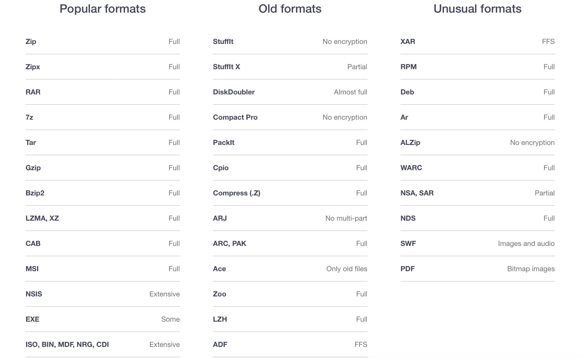

# mac软件推荐

## 免费

paste
utool

---

## 
录屏-Kap-开源免费-支持M1
官网：https://getkap.co

这个软件很简单，如果你不喜欢OBS复杂的设置选这个没错。系统自带的录屏软件录制文件太大了，Kap可以兼顾录制质量和视频大小，还提供多种格式导出。

可以选择录制全屏幕或者某个窗口，或者是选定的屏幕范围

---

## 
图片压缩-IMAGE SHRINKER-开源免费-Intel版本
官网：https://image-shrinker.com

虽然不支持M1，但作为一个图片压缩软件足够用了，还支持GIF压缩！

---

##
鼠标滚动翻转-Scroll Reverser-开源免费-支持M1
官网：https://pilotmoon.com/scrollreverser/

我喜欢Mac触控板开启自然滚动，鼠标不开启自然滚动，因为鼠标的自然滚动和Windows是相反的。但是Mac系统触控板开启自然滚动后鼠标也开启了，这俩设备不支持单独调整。

Scroll Reverser是一个简单的小插件，帮助实现分开控制滚动方向。

---
## 
解压工具-The Unarchiver-免费-支持M1
官网：https://theunarchiver.com

默认解压缩工具只能解压或压缩 .zip 格式文件，所以还需要其他软件做补充。The Unarchiver 解压速度很快，基本上常见的格式都支持，用起来基本无感，有一种原生应用的感觉。

支持格式：

---
## 
状态监控-Stats-开源免费-支持M1
Github主页：https://github.com/exelban/stats

很好用的菜单栏状态显示软件，提供多种样式选择，电池还有详细信息预测充满时间。可以用来显示CPU，GPU，内存，磁盘，传感器，网络，蓝牙的信息。

---

## 收费

画图软件

